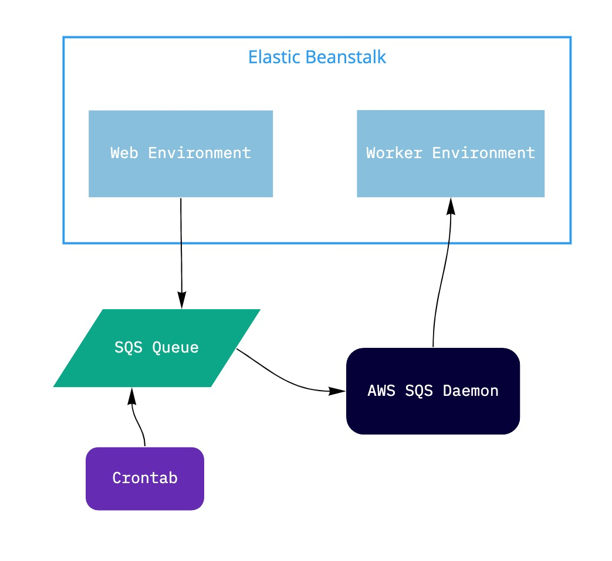

[](https://opensource.org/licenses/MIT)

# django-eb-sqs-worker

Django Background Tasks for Amazon Elastic Beanstalk.

Created by Alexey "DataGreed" Strelkov.

## Overview

_django-eb-sqs-worker_ lets you handle background jobs on [Elastic Beanstalk Worker Environment](https://docs.aws.amazon.com/elasticbeanstalk/latest/dg/using-features-managing-env-tiers.html) sent via SQS and provides methods to send tasks to worker.

You can use the same Django codebase for both your Web Tier and Worker Tier environments and send tasks 
from Web environment to Worker environment. Amazon fully manages autoscaling for you. 

Tasks are sent via [Amazon Simple Queue Service](https://docs.aws.amazon.com/AWSSimpleQueueService/latest/SQSDeveloperGuide/welcome.html) and are delivered to your worker with [Elastic Beanstalk's SQS daemon](https://docs.aws.amazon.com/elasticbeanstalk/latest/dg/using-features-managing-env-tiers.html#worker-daemon). 
Periodic tasks are also supported. 

Here's the diagram of how tasks move through the system, tasks movement is represented by arrows:



## Installation

Install using pip `#TODO: publish on pip`
```
pip install -e git+git//github.com/DataGreed/django-eb-sqs-worker.git#egg=django-eb-sqs-worker
```


```
pip install django-eb-sqs-worker
```

Add `eb_sqs_worker` to `settings.INSTALLED_APPS`:
```python
INSTALLED_APPS = [
    # ...
    "eb_sqs_worker",
]
```

Add eb-sqs-worker urls to your project's main `urls.py` module:
```python
# urls.py

urlpatterns = [
    # your url patterns
    # ... 
]

from eb_sqs_worker.urls import urlpatterns as eb_sqs_urlpatterns
urlpatterns += eb_sqs_urlpatterns
```


`#TODO settings`

`#TODO urls`

## Usage

`#TODO`

### Defining Jobs

`#TODO`

### Sending jobs to worker

`#TODO`

### Periodic jobs

`#TODO` (add link to https://docs.aws.amazon.com/elasticbeanstalk/latest/dg/using-features-managing-env-tiers.html#worker-periodictasks), explain configuration

## Settings

### AWS_EB_HANDLE_SQS_TASKS
If set to `True`, tasks will be accepted and handled on this instance. If set to `False`, the URL for handling 
tasks will return 404. Defaults to `False`.

**Important:** set this to `True` _only_ on your [Worker environment](https://docs.aws.amazon.com/elasticbeanstalk/latest/dg/using-features-managing-env-tiers.html)

### AWS_EB_ENABLED_TASKS
Dictionary of enabled tasks. Routes task names to actual task methods.

E.g.:

```python
AWS_EB_ENABLED_TASKS = {
    # name used in serialization   # path to actual method that does the job
    "accounts_confirmation_email": "accounts.tasks.send_confirmation_email",
    "analytics_track_event": "analytics.tasks.track_event"
}
``` 

### AWS_EB_DEFAULT_REGION

Default Elastic Beanstalk Region. Use the one that your app id deployed in. 

### AWS_EB_DEFAULT_QUEUE_NAME

Name of the queue used by default.

### AWS_ACCESS_KEY_ID

Amazon Access Key Id, refer to [the docs](https://docs.aws.amazon.com/general/latest/gr/aws-sec-cred-types.html#access-keys-and-secret-access-keys)

### AWS_SECRET_ACCESS_KEY

Amazon Secret Access Key, refer to [the docs](https://docs.aws.amazon.com/general/latest/gr/aws-sec-cred-types.html#access-keys-and-secret-access-keys)

### AWS_EB_RUN_TASKS_LOCALLY

If set to true, all tasks will be run locally and synchronnously instead of being sent to SQS Queue. Defaults to `False`

## Security

Always set `AWS_EB_HANDLE_SQS_TASKS=False` on Web Tier Environment so the tasks could not be spoofed! 
Web Tier environments are typically used for hosting publici websites and can be accessed by anoyone on the Internet, 
meaning that anyone can send any jobs to your site if you leave this option on on Web environment.

Worker environments can only be accessed internally, e.g. via SQS Daemon that POSTs, so `AWS_EB_HANDLE_SQS_TASKS=True` 
should be set only on worker environments.

Use [Elastic Beanstalk Environment properties](https://docs.aws.amazon.com/elasticbeanstalk/latest/dg/environments-cfg-softwaresettings.html#environments-cfg-softwaresettings-console) 
to supply different setting files for Web and Worker environments. See also: [docs on designating the Django settings](https://docs.djangoproject.com/en/3.0/topics/settings/#designating-the-settings)

## Tips

`#TODO`

### Accessing Web Tier Database from Worker

`#TODO`

### Delay abstraction

`#TODO`

### Using different cron files for different environments

`#TODO`

## Testing

### Synchronous mode

When developing on local machine it might be a good idea to set `AWS_EB_RUN_TASKS_LOCALLY=True`, so all the tasks 
that should normally be sent to queue will be executed locally on the same machine in sync mode. This lets you test
your actual task methods in integration tests.

### Testing django-eb-sqs-worker itself

Clone the repository.

```
git clone https://github.com/DataGreed/django-eb-sqs-worker.git
```

Install requirements (use python virtual environment)
```
cd django-eb-sqs-worker
pip install -r requirements.txt
```

Run tests
```
sh test.sh
```


## Contributing

If you would like to contribute, please make a Pull Request with the description of changes and add tests to cover
these changes.

Feel free to open issues if you have any problems or questions with this package.

# TODOs

- take advantage of the new [environment link feature](https://docs.aws.amazon.com/elasticbeanstalk/latest/dg/environment-cfg-links.html)
- decorators for easier setup
- add pickle serialization

---
Search tags 

Django Elastic Beanstalk Worker Web Tier Asynchronous Jobs Background Tasks SQS  